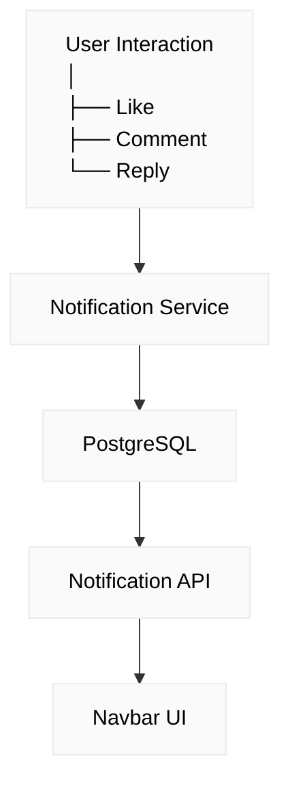

# 🚀 DevConnect

<p align="center">
  A modern full-stack developer community platform where developers can connect, share posts, interact with each other, and build a professional developer network.
</p>

<p align="center">
  <a href="https://github.com/raihankabir1952/DevConnect">
    
  </a>
  
  
  
  
  
</p>

---

## 🌐 Live Demo

> 🚧 Live demo will be added soon.

---

## 📂 Repository

🔗 **GitHub:**  
https://github.com/raihankabir1952/DevConnect

---

## 📌 About The Project

**DevConnect** is a full-stack social networking platform designed specifically for developers.

The goal of the project is to create a place where developers can:

- Create and share posts
- Upload images with posts
- Like and comment on posts
- Reply to comments
- Follow other developers
- Search for users
- Manage their profiles
- Upload profile and cover images
- Receive real-time-style notifications for interactions
- Verify their email address
- Reset forgotten passwords securely
- The app also supports real-time notifications using WebSockets (Socket.IO).

The project was built to practice and demonstrate real-world **frontend + backend development**, authentication, relational database design, REST API development, file uploads, notifications, and responsive UI development.

---

# ✨ Features

## 🔐 Authentication

- User registration
- User login
- JWT-based authentication
- Password hashing with bcrypt
- Protected routes
- Email verification
- Forgot password functionality
- Password reset through email
- Secure authentication flow

---

## 📝 Post Management

Users can:

- Create posts
- Add post title and content
- Upload an optional image
- View posts
- Edit their own posts
- Delete their own posts
- Search posts
- View post details
- See post engagement statistics

Each post displays:

- Author information
- Profile image
- Post image
- Likes
- Comments
- Creation date

---

## ❤️ Like System

Users can:

- Like posts
- Unlike posts
- See total likes
- Receive notifications when someone likes their post

---

## 💬 Comments & Replies

DevConnect supports an interactive comment system.

Features include:

- Add comments
- Edit comments
- Delete comments
- Reply to comments
- Nested replies
- User profile information on comments
- User profile information on replies

This creates a more realistic social-media-style discussion system.

---

## 👥 Follow System

Users can:

- Follow other developers
- Unfollow developers
- View follower count
- View following count
- Visit other users' profiles

The profile page also displays overall community activity.

---

## 🔎 User Search

Users can search for other developers by name.

Search results include:

- Profile image
- User name
- Profile link

This allows users to quickly discover and connect with other developers.

---

## 👤 Developer Profiles

Each user has a dedicated profile page containing:

- Profile image
- Cover image
- Name
- Email
- Bio
- Total posts
- Followers
- Following
- Comments
- Likes
- User's posts

Users can also:

- Edit their profile
- Update their bio
- Upload a profile image
- Upload a cover image

---

## 🔔 Notifications

DevConnect includes an interaction notification system.

Users receive notifications for activities such as:

- ❤️ Someone liked your post
- 💬 Someone commented on your post
- ↩️ Someone replied to your comment

The notification system supports:

- Unread notification indicator
- Notification dropdown
- Mark individual notification as read
- Mark all notifications as read
- Actor profile images
- Related post information
- ⚡ Real-time notifications using WebSockets (Socket.IO)

---

## 📧 Email Features

The application includes email-based account functionality using **Nodemailer + Gmail SMTP**.

Supported features:

- Email verification
- Forgot password
- Password reset
- Verification/reset links through email

---

## 🖼️ Image Upload

DevConnect supports image uploads for:

- Profile pictures
- Cover pictures
- Post images

The backend uses **Multer** for handling multipart/form-data uploads.

Image validation includes:

- Image file type validation
- File size validation
- Separate upload directories

---

## 📄 Search & Pagination

The post feed supports:

- Search by title
- Search by content
- Pagination
- Configurable page size
- Total post count
- Total page count
- Next/previous page information

This helps keep the feed efficient when the number of posts grows.

---

## 📱 Responsive UI

The frontend is designed to work across:

- 💻 Desktop
- 💻 Laptop
- 📱 Tablet
- 📱 Mobile

The interface includes responsive:

- Navbar
- Search
- Post cards
- Comment sections
- Profile pages
- Notifications
- Forms
- Modals

---

# 🛠️ Tech Stack

## Frontend

| Technology | Purpose |
|---|---|
| **Next.js 16** | React framework |
| **TypeScript** | Type safety |
| **Tailwind CSS 4** | Styling & responsive UI |
| **React** | UI development |
| **Lucide React** | UI icons |

---

## Backend

| Technology | Purpose |
|---|---|
| **NestJS** | Backend framework |
| **TypeScript** | Backend development |
| **Prisma** | ORM & database access |
| **PostgreSQL** | Relational database |
| **JWT** | Authentication |
| **bcrypt** | Password hashing |
| **Multer** | File uploads |
| **Nodemailer** | Email functionality |

---

# 🏗️ Project Architecture

DevConnect follows a separated frontend/backend architecture.

```text
DevConnect
│
├── frontend
│   │
│   ├── Next.js
│   ├── TypeScript
│   ├── Tailwind CSS
│   ├── Authentication UI
│   ├── Feed
│   ├── Profiles
│   ├── Comments
│   ├── Notifications
│   └── Responsive UI
│
└── backend
    │
    ├── NestJS
    ├── Prisma
    ├── PostgreSQL
    ├── Authentication
    ├── Posts
    ├── Comments
    ├── Likes
    ├── Follow System
    ├── Notifications
    ├── User Management
    └── File Uploads

## 🔐 Authentication Flow

DevConnect uses **JWT-based authentication** to securely authenticate users and protect private API endpoints.

### 🔄 Authentication Process

```text
User
  │
  ▼
Login / Register
  │
  ▼
Backend Authentication
  │
  ▼
JWT Access Token
  │
  ▼
Frontend Stores Token
  │
  ▼
Protected API Requests
  │
  ▼
JwtAuthGuard
  │
  ▼
Authorized User
```

### 🔑 Security

* 🔐 Passwords are securely hashed using **bcrypt** before being stored in the database.
* 🎫 **JWT access tokens** are used to authenticate protected requests.
* 🛡️ **JwtAuthGuard** validates the token before allowing access to protected endpoints.
* 👤 Only authenticated users can access protected resources.

### 🔔 Notification Flow
Notifications are generated when users interact with posts.


### 🗄️ Database Design
The application uses **PostgreSQL** with **Prisma ORM**.

Major entities include:

```text
User
│
├── Posts
├── Comments
├── Likes
├── Followers
├── Following
├── Notifications
├── Profile Image
└── Cover Image

Post
│
├── Author
├── Image
├── Likes
├── Comments
└── Notifications

Comment
│
├── User
├── Post
├── Parent Comment
└── Replies
```

The relational structure allows the application to manage social interactions while maintaining data consistency.

### 📂 Main Backend Modules

```text
backend/
│
├── auth/
├── users/
├── posts/
├── comments/
├── likes/
├── notifications/
├── prisma/
└── uploads/
```

Each feature is organized into its own NestJS module to keep the backend maintainable and scalable.

### 🧪 Testing
The application was tested across the major user flows:

- Registration
- Login
- Email verification
- Forgot password
- Password reset
- Post creation
- Post editing
- Post deletion
- Image upload
- Like/unlike
- Comment creation
- Comment editing
- Comment deletion
- Comment replies
- Follow/unfollow
- User search
- Profile editing
- Notifications
- Responsive layouts

### 💡 Challenges & Solutions

#### 1. Authentication & Authorization
Implemented JWT authentication with protected API routes to ensure users can only access authorized resources.

---

#### 2. Nested Comments
Implemented parent-child comment relationships to support replies while keeping comments connected to their original post and user.

---

#### 3. Notification System
Designed a notification model connected with users, actors, and posts so interactions can generate contextual notifications.

---

#### 4. File Uploads
Integrated Multer to handle profile, cover, and post image uploads with validation for file type and size.

---

#### 5. Relational Database Design
Designed PostgreSQL relationships for users, posts, comments, likes, followers, and notifications using Prisma ORM.

### 🔮 Future Improvements
Possible future improvements include:

- 🏷️ Developer skill tags
- 💼 Developer portfolio section
- 💬 Real-time chat
- 🌙 Dark mode
- 📊 User activity analytics
- 🚀 Production deployment
- 🐳 Docker containerization
- ⚙️ CI/CD pipeline

---

### 📚 What I Learned
While building DevConnect, I gained practical experience with:

- Full-stack application architecture
- Next.js App Router
- TypeScript
- NestJS modular architecture
- REST API development
- JWT authentication
- Authorization & protected routes
- Prisma ORM
- PostgreSQL relational database design
- File upload handling with Multer
- Email verification and password reset
- Nested comments and replies
- Notification systems
- Pagination and search
- Responsive UI development
- Frontend-backend integration
- Error handling
- Git & GitHub workflow
- Implemented real-time notifications using WebSockets (Socket.IO) in a NestJS + Next.js application.

---

---

### 👨‍💻 Developer

| **Md Raihan Kabir** |
| :--- |
| 🎓 **CSE Student** \| 💻 **Full-Stack Web Developer** |
| 🐙 **GitHub:** [@raihankabir1952](https://github.com) ↗️ |
| 📂 **Project Repository:** [DevConnect](https://github.com/DevConnect) ↗️ |

---
